# Miooowo

## GitHub Stats

<picture>
  <source media="(prefers-color-scheme: dark)" srcset="./profile/stats-dark.svg">
  <source media="(prefers-color-scheme: light)" srcset="./profile/stats-light.svg">
  
</picture>

<picture>
  <source media="(prefers-color-scheme: dark)" srcset="./profile/top-langs-dark.svg">
  <source media="(prefers-color-scheme: light)" srcset="./profile/top-langs-light.svg">
  
</picture>

<picture>
 <source media="(prefers-color-scheme: dark)" srcset="./profile/wakatime-dark.svg">
  <source media="(prefers-color-scheme: light)" srcset="./profile/wakatime-light.svg">
  

  
### Profile Views

